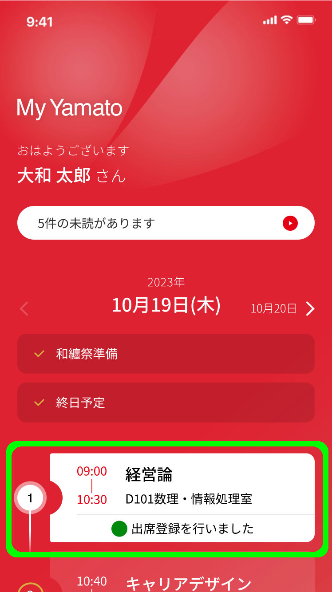
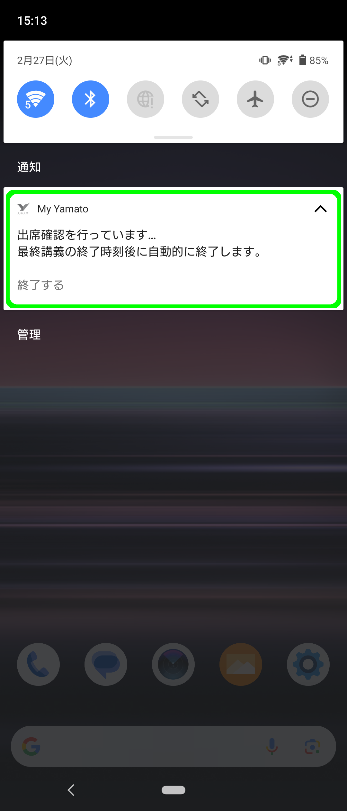

---
layout:
  title:
    visible: true
  description:
    visible: false
  tableOfContents:
    visible: true
  outline:
    visible: false
  pagination:
    visible: false
---

# 出席検知

My Yamatoアプリを使用した出席検知について解説します。


出席検知の仕組みをご利用いただくには、アプリに対する権限が適切にされていることが前提となります。[こちらのページ](../setup/permissions1.md)を参考に設定いただきますようお願いいたします。


## 出席検知のご利用方法

教室に入室したタイミングでアプリを起動し、該当の講義への出席状態が反映されることをご確認ください。[^1]

<figure><figcaption></figcaption></figure>

講義へ出席したことの検知は、教室に設置された発信機（ビーコン）とアプリが通信することによって実現します。ビーコンとの通信を確実に行うためにはアプリが起動していることが必要です。必ずアプリを起動し出席状態を確認いただきますようお願いいたします。

## 検知の仕組み

My Yamatoでは以下のステップで出席を検知します。

1. 教室のビーコンが講義開始時に（10分前〜15分後、1分に1回）に信号を発信する
2. 起動中のアプリが信号を受信し、その記録をサーバーに送信する
3. サーバーは、記録にある受信日時を判定し出席状態を記録する
4. アプリが出席状態をサーバーに問い合わせ、画面に反映する


遅刻などの判定のため、講義の途中と終了前にも同様の通信を行います。

* 講義開始から60分後〜65分後
* 講義開始から80分後〜85分後


上記の２番目のステップが確実に実施されるように、講義に出席した際は最初にアプリを起動してください。遅刻や早退のルールは現行のルールと同様になります。


My Yamatoアプリにおける出席検知では、GPS（衛星による位置の特定）を使用しておらず、教室の範囲外では位置情報を取得いたしません。プライベートを侵害する心配がないことをご理解ください。


## アプリを起動しなかった場合

アプリが起動していない状態でもビーコンとの通信を行う仕組み（下記）もありますが、直接起動に比べると精度が低く、正確に出席を検知できない場合があります。あくまで補助機能とお考えください。



アプリが起動していない状態でも、OSが信号を受信したタイミングでプログラムが起動し、サーバーに記録を残します（Core Location Framework）



アプリを終了させた後も出席検知機能のみ起動し続けます（フォアグラウンドサービス）

サービスの起動中は通知に表示されますが、通知からサービスを終了した場合は検知できません。また、当日の講義終了時刻にサービスも自動的に終了いたします。

<figure><figcaption></figcaption></figure>



[^1]: 
