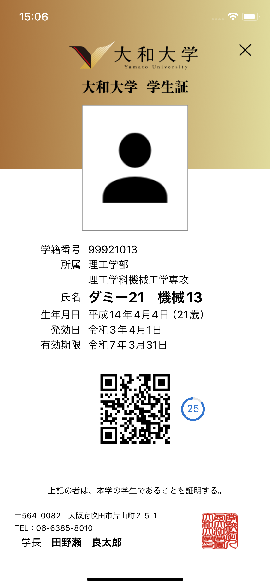

---
layout:
  title:
    visible: true
  description:
    visible: false
  tableOfContents:
    visible: true
  outline:
    visible: false
  pagination:
    visible: false
---

# デジタル学生証

My Yamatoの学生証機能について解説します。


通学定期券や学割乗車券の申請にデジタル学生証はご利用いただけません。


## 学生証画面

<figure><figcaption></figcaption></figure>

### 基本情報

写真、学籍番号、所属や氏名など、My Yamatoアプリにログインしたユーザーの個人情報を表示します。期末試験などではこちらがわかるようにご提示ください。

### 認証コード

本人確認のための認証コードをQRコードの形式で表示します。図書館への入館のほか、My Yamatoアプリの教員向け機能からの読み取りに使用します。

セキュリティの観点から認証コードは30秒ごとに更新され続けます。コードリーダーにかざすことでそのままお使いいだけますが、読み取りが難しい場合は、QRコードをタップすることで大きなQRコードを表示する画面を立ち上げます。
