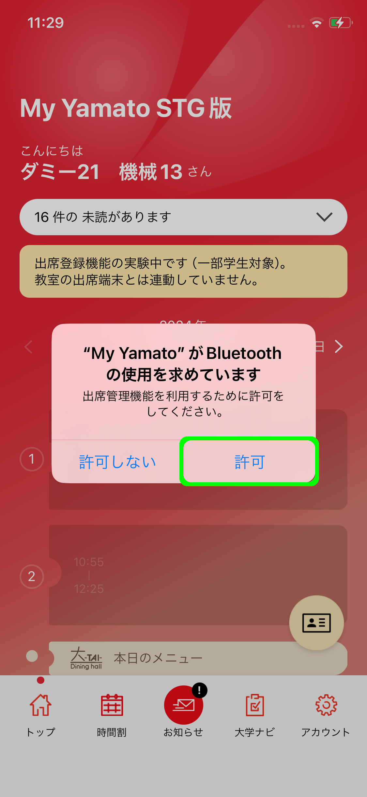
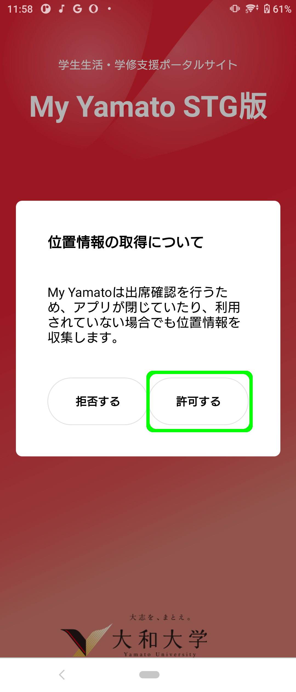
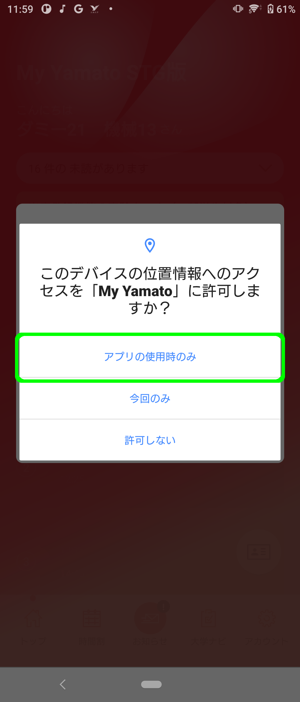
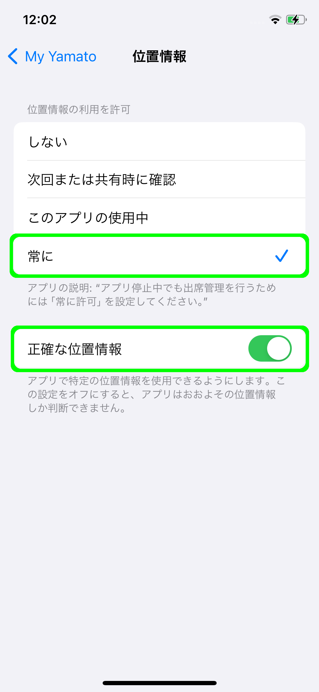

# ✅ アプリの権限設定

My Yamatoアプリには、学生の皆様へ向けたお知らせの配信やアプリを利用した出席検知の機能があります。それらをご利用いただくために、初回起動時に適切に権限を設定していただくようお願いいたします。初回起動後に権限を正しく変更する手順については[こちら](permissions.md#karawosuru)をご参照ください。


出席検知の仕組みについては[こちらページ](../features/detect-attendance.md)をご参照ください。


## 初回起動時の権限設定

My Yamatoをインストールして初めてアプリを起動した際に、OSが持つ情報や機能に対してアプリが利用して良いかどうかの判断を求めるダイアログが表示されます。こちらの設定方法について解説いたします。



### 位置情報の使用を許可する

<figure><figcaption></figcaption></figure>

上記のダイアログにて「アプリの使用中は許可」を選択してください。

### 位置情報の使用を「常に許可」に変更する

<figure><figcaption></figcaption></figure>

上記のダイアログにて「”常に許可”に変更」を選択してください。アプリが起動していない場合にも出席検知をOSがサポートできるように設定します。

### 通知の使用を許可する

<figure><figcaption></figcaption></figure>

上記のダイアログにて「許可」を選択してください。

### Bluetoothの使用を許可する

<figure><figcaption></figcaption></figure>

上記のダイアログにて「許可」を選択してください。出席検知において、教室に設置されたビーコンとアプリが通信を行えるように設定します。



### 位置情報の取得を許可する

<figure><figcaption></figcaption></figure>

上記のダイアログにて「許可する」を選択して下さい。

### 位置情報の使用を許可する

<figure><figcaption></figcaption></figure>

初回ログインの後、上記のダイアログにて「アプリの使用時のみ」を選択して下さい。



## 初回起動後の権限設定

初回起動後に権限を設定する場合、もしくは、現在の設定をご確認いただく方法について記述いたします。



### アプリの設定画面

<figure><figcaption></figcaption></figure>

設定 ＞ My Yamato と進みアプリの設定画面を開きます。

### 位置情報の許可設定

<figure><figcaption></figcaption></figure>

アプリの設定画面の「位置情報」をタップし、その先の設定画面にて位置情報を「常に許可」と設定してください。また、「正確な位置情報」がオンになっていることを確認してください。

### Bluetoothの許可設定

<figure><figcaption></figcaption></figure>

アプリの設定画面にて「Bluetooth」をオンに設定してください。

### 通知の許可設定

<figure><figcaption></figcaption></figure>

アプリの設定画面の通知をタップし、その先の設定画面にて「通知を許可」をオンに設定してください。



### アプリの設定画面

<figure><figcaption></figcaption></figure>

My Yamatoアプリのアイコンを長押しします。開いたダイアログから「アプリ情報」をタップしてアプリの設定画面を開きます。

### 通知の許可設定

<figure><figcaption></figcaption></figure>

アプリの設定画面の「通知」をタップし、その先の設定画面にて「My Yamatoのすべての通知」をオンに設定してください。

### 位置情報の許可設定

<figure><figcaption></figcaption></figure>

アプリの設定画面の「許可」をタップ、その先の画面で「位置情報」をタップし、開いた設定画面にて「アプリの使用中のみ許可」を選択してください。



