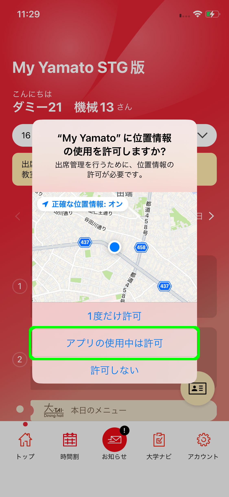
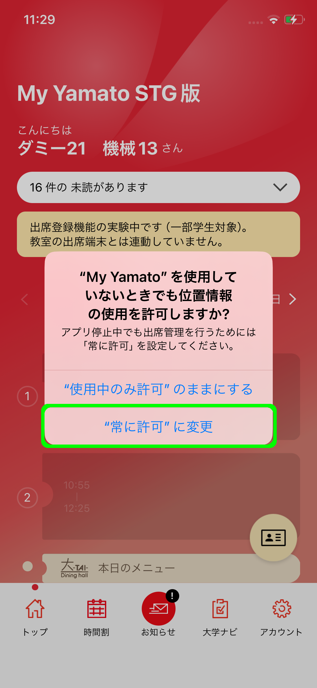
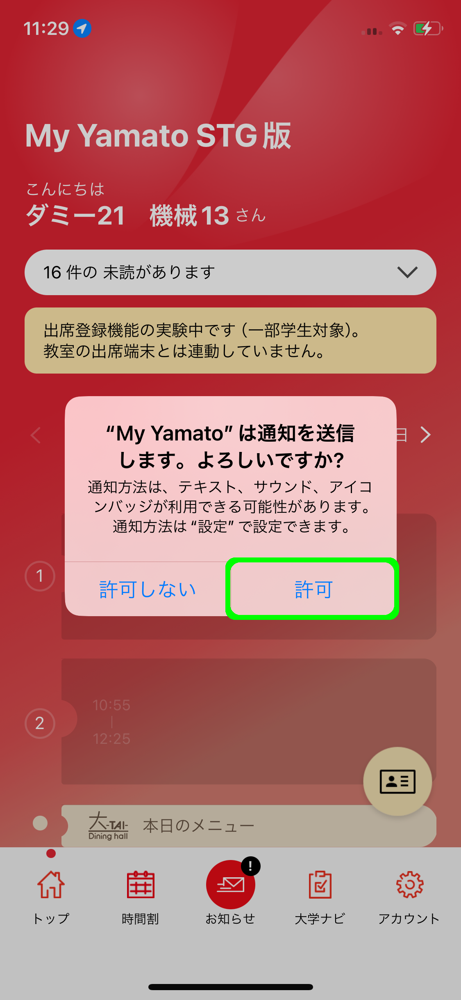
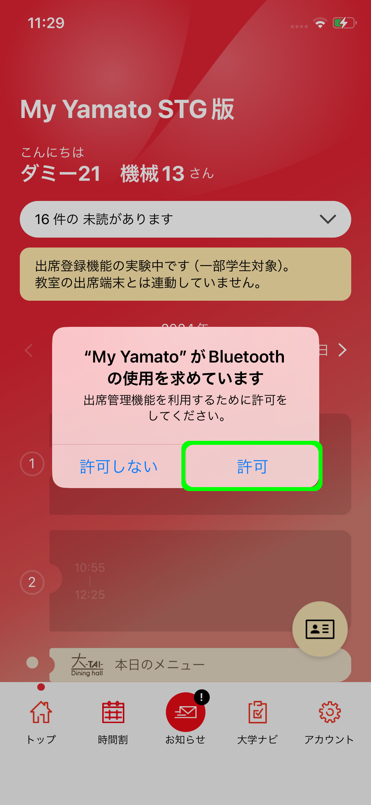
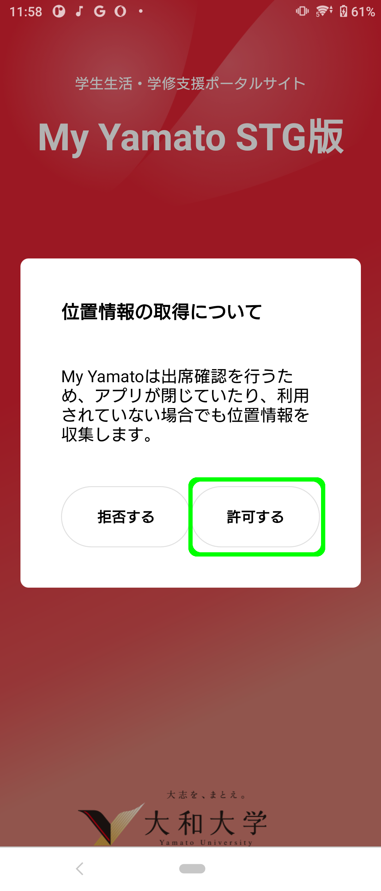
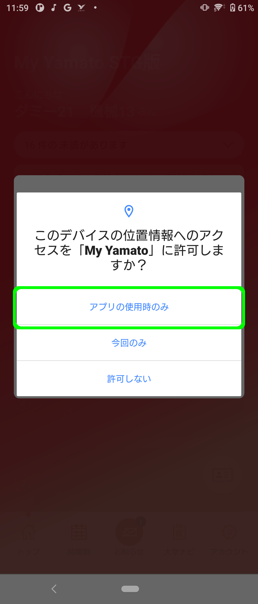

# アプリの権限設定（初回起動時）

My Yamatoをインストールして初めてアプリを起動した際に、OSが持つ情報や機能に対してアプリが利用して良いかどうかの判断を求めるダイアログが表示されます。それらの設定方法について解説します。



### 位置情報の使用を許可する

<figure><figcaption></figcaption></figure>

上記のダイアログにて「アプリの使用中は許可」を選択してください。

### 位置情報の使用を「常に許可」に変更する

<figure><figcaption></figcaption></figure>

上記のダイアログにて「”常に許可”に変更」を選択してください。アプリが起動していない場合にも出席検知をOSがサポートできるように設定します。

### 通知の使用を許可する

<figure><figcaption></figcaption></figure>

上記のダイアログにて「許可」を選択してください。

### Bluetoothの使用を許可する

<figure><figcaption></figcaption></figure>

上記のダイアログにて「許可」を選択してください。出席検知において、教室に設置されたビーコンとアプリが通信を行えるように設定します。



### 位置情報の取得を許可する

<figure><figcaption></figcaption></figure>

上記のダイアログにて「許可する」を選択して下さい。

### 位置情報の使用を許可する

<figure><figcaption></figcaption></figure>

初回ログインの後、上記のダイアログにて「アプリの使用時のみ」を選択して下さい。



