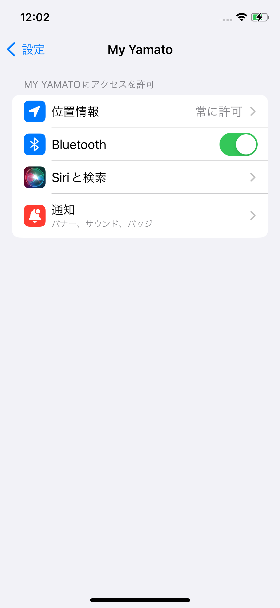
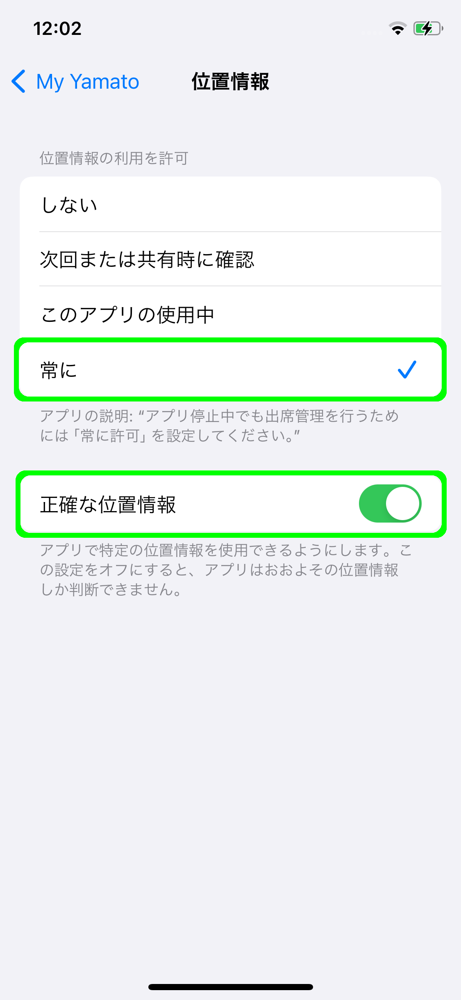
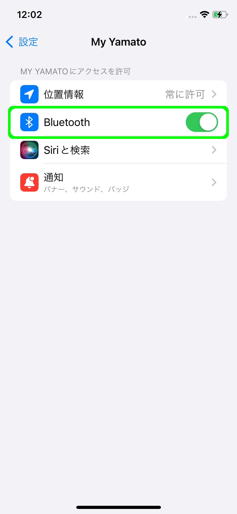
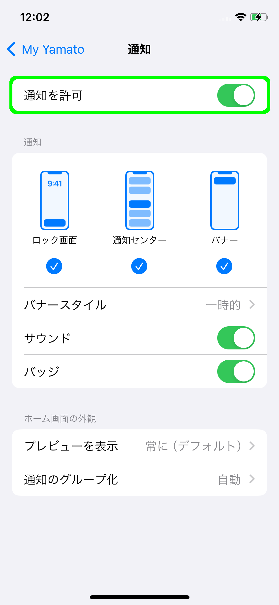
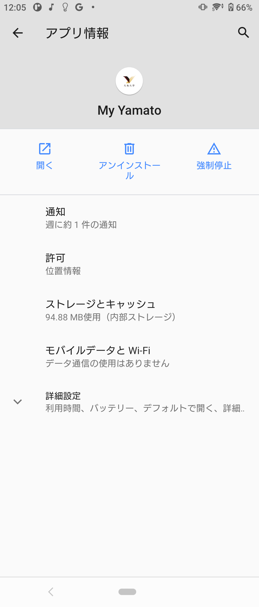
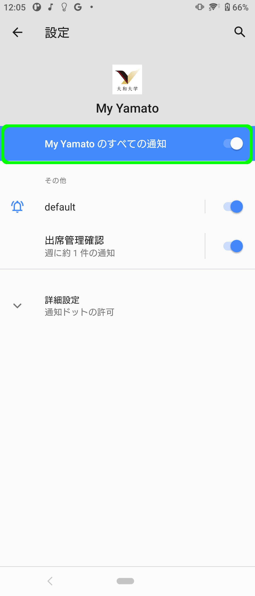
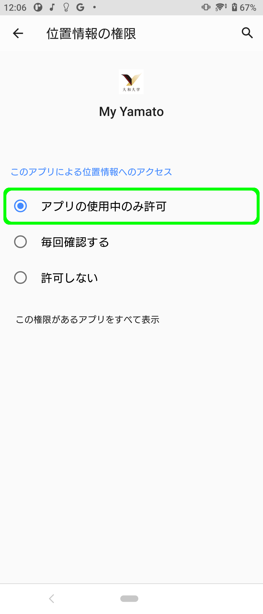

# アプリの権限設定（初回起動後）

初回起動後に権限を設定する場合、もしくは、現在の設定をご確認いただく方法について解説します。



### アプリの設定画面

<figure><figcaption></figcaption></figure>

設定 ＞ My Yamato と進みアプリの設定画面を開きます。

### 位置情報の許可設定

<figure><figcaption></figcaption></figure>

アプリの設定画面の「位置情報」をタップし、その先の設定画面にて位置情報を「常に許可」と設定してください。また、「正確な位置情報」がオンになっていることを確認してください。

### Bluetoothの許可設定

<figure><figcaption></figcaption></figure>

アプリの設定画面にて「Bluetooth」をオンに設定してください。

### 通知の許可設定

<figure><figcaption></figcaption></figure>

アプリの設定画面の通知をタップし、その先の設定画面にて「通知を許可」をオンに設定してください。



### アプリの設定画面

<figure><figcaption></figcaption></figure>

My Yamatoアプリのアイコンを長押しします。開いたダイアログから「アプリ情報」をタップしてアプリの設定画面を開きます。

### 通知の許可設定

<figure><figcaption></figcaption></figure>

アプリの設定画面の「通知」をタップし、その先の設定画面にて「My Yamatoのすべての通知」をオンに設定してください。

### 位置情報の許可設定

<figure><figcaption></figcaption></figure>

アプリの設定画面の「許可」をタップ、その先の画面で「位置情報」をタップし、開いた設定画面にて「アプリの使用中のみ許可」を選択してください。



